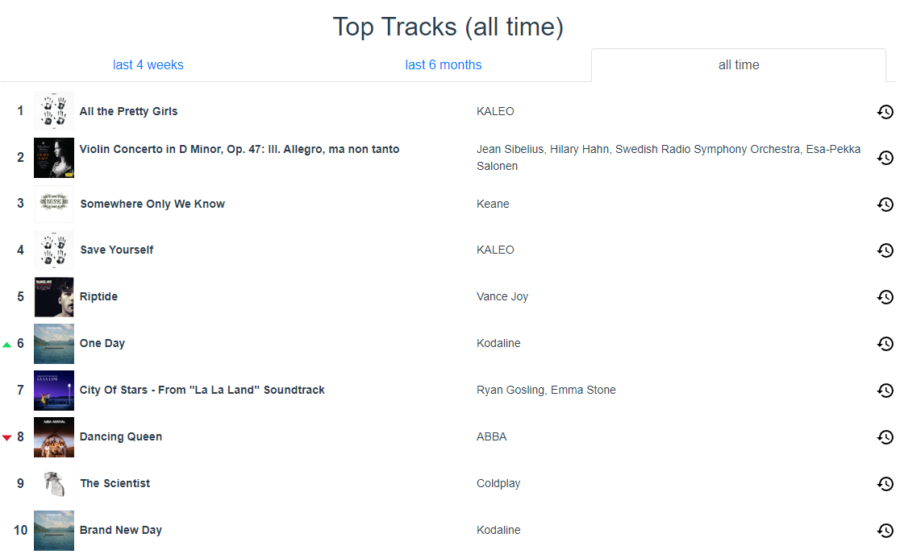
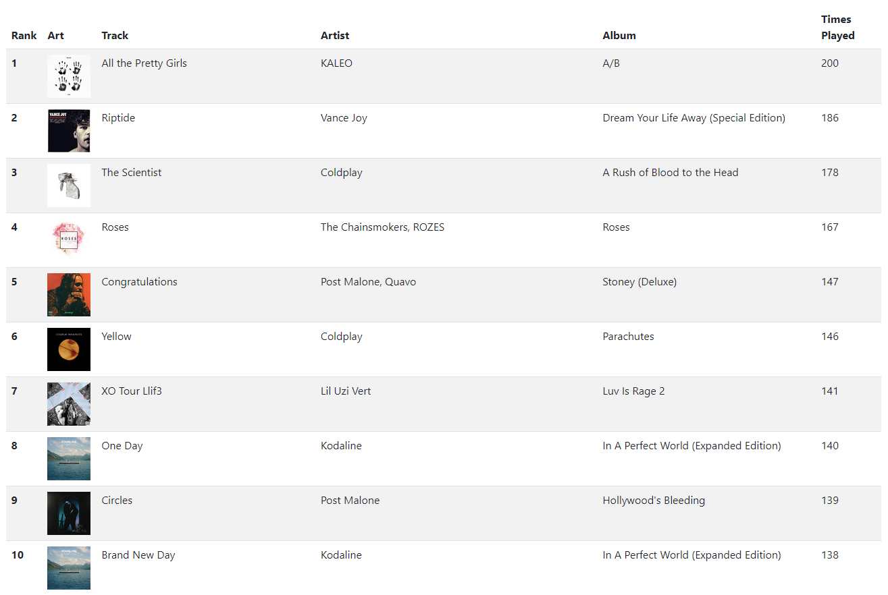

# Better Stats for Spotify

## Motivation
There are many web-based utilities that use the Spotify Web API to display your "top songs" over various time ranges.
For example, here are my all-time top songs according to *Stats for Spotify*:

However, I have frequently found myself questioning the accuracy of these results. After all, the Spotify Web API is a black box - it is unclear how it determines what your "top songs" are.
So, I decided to develop my own solution - one that used concrete user data to determine a user's most played tracks within any timeframe.
Here are my all-time top songs according to *Better Stats for Spotify*:

Somewhat similar, but definitely not the same.

## Summary
Better Stats for Spotify allows users to login with their Spotify credentials and then upload their Spotify user data.
Spotify user data can be obtained from the "Privacy settings" section of your Spotify account page.
Then, the application uses the data to generate a list of the user's most played tracks. The list is displayed in table form, with cover art and artist names being retrieved using the Spotify Web API.
Finally, users can change the scope of the results by entering a specific timeframe to analyze, and by setting a listening threshold (how long a track must be played for it to count).

## Demo

(Colors are slightly off due to the limitations of GIFs)

## Next Steps
This tool is still a work in progress! Possible future improvements include:
- Graphs to display how often a particular track was played as a function of time
- Analysis of total tracks played per day as a function of time
- Ability to save top tracks to a Spotify playlist
- Ability to view more track details (such as audio features) for each track in the list
- More robust filtering functionality
- Ability to view top artists

---

# Getting Started with Create React App

This project was bootstrapped with [Create React App](https://github.com/facebook/create-react-app).

## Available Scripts

In the project directory, you can run:

### `npm start`

Runs the app in the development mode.\
Open [http://localhost:3000](http://localhost:3000) to view it in your browser.

The page will reload when you make changes.\
You may also see any lint errors in the console.

### `npm test`

Launches the test runner in the interactive watch mode.\
See the section about [running tests](https://facebook.github.io/create-react-app/docs/running-tests) for more information.

### `npm run build`

Builds the app for production to the `build` folder.\
It correctly bundles React in production mode and optimizes the build for the best performance.

The build is minified and the filenames include the hashes.\
Your app is ready to be deployed!

See the section about [deployment](https://facebook.github.io/create-react-app/docs/deployment) for more information.

### `npm run eject`

**Note: this is a one-way operation. Once you `eject`, you can't go back!**

If you aren't satisfied with the build tool and configuration choices, you can `eject` at any time. This command will remove the single build dependency from your project.

Instead, it will copy all the configuration files and the transitive dependencies (webpack, Babel, ESLint, etc) right into your project so you have full control over them. All of the commands except `eject` will still work, but they will point to the copied scripts so you can tweak them. At this point you're on your own.

You don't have to ever use `eject`. The curated feature set is suitable for small and middle deployments, and you shouldn't feel obligated to use this feature. However we understand that this tool wouldn't be useful if you couldn't customize it when you are ready for it.

## Learn More

You can learn more in the [Create React App documentation](https://facebook.github.io/create-react-app/docs/getting-started).

To learn React, check out the [React documentation](https://reactjs.org/).

### Code Splitting

This section has moved here: [https://facebook.github.io/create-react-app/docs/code-splitting](https://facebook.github.io/create-react-app/docs/code-splitting)

### Analyzing the Bundle Size

This section has moved here: [https://facebook.github.io/create-react-app/docs/analyzing-the-bundle-size](https://facebook.github.io/create-react-app/docs/analyzing-the-bundle-size)

### Making a Progressive Web App

This section has moved here: [https://facebook.github.io/create-react-app/docs/making-a-progressive-web-app](https://facebook.github.io/create-react-app/docs/making-a-progressive-web-app)

### Advanced Configuration

This section has moved here: [https://facebook.github.io/create-react-app/docs/advanced-configuration](https://facebook.github.io/create-react-app/docs/advanced-configuration)

### Deployment

This section has moved here: [https://facebook.github.io/create-react-app/docs/deployment](https://facebook.github.io/create-react-app/docs/deployment)

### `npm run build` fails to minify

This section has moved here: [https://facebook.github.io/create-react-app/docs/troubleshooting#npm-run-build-fails-to-minify](https://facebook.github.io/create-react-app/docs/troubleshooting#npm-run-build-fails-to-minify)
